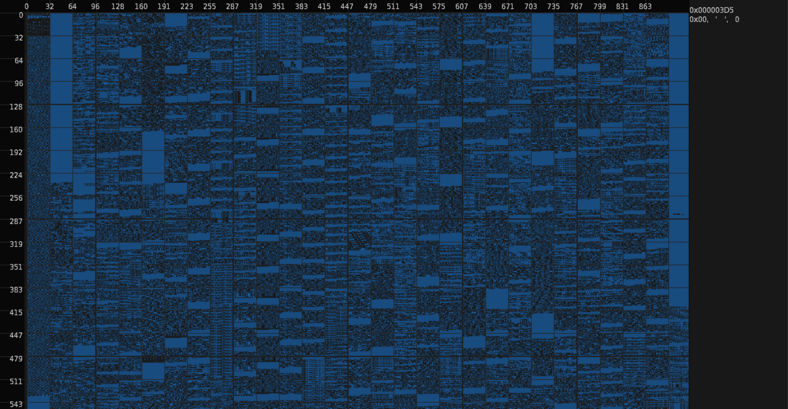

# Byte Image Inspector

## Usage

```txt
Usage: fimg <options>

  <options>:

    -h, --help   Display this help message.
    -r, --range  Specify a start address and a range.
                   - Arguments: [address, range]
                     - Address Base 16 [0 - file length]
                     - Range   Base 10 [0 - file length]

    -m, --max    Specify the power of two pixel range that determines a new row.
                   - Arguments: [32,64,128,256]

    -w, --window Graph items in a window.
                   - Arguments: [width, height]
                     - Width  [200 - 7680]
                     - Height [100 - 4320]
```

## Example Output



