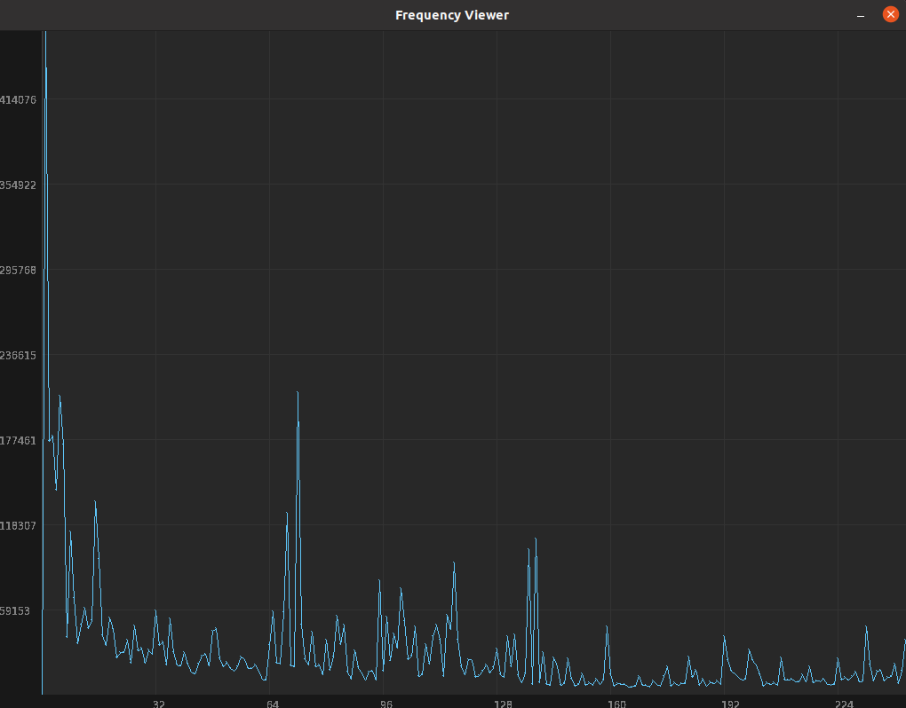

# Byte Frequency Viewer

## Usage 

```txt
Usage: freq <options>

  <options>:

    -h, --help     Display this help message.
    -r, --range    Specify a start address and a range.
                     - Arguments: [address, range]
                       - Address Base 16 [0 - file length]
                       - Range   Base 10 [0 - file length]

        --no-drop  Do not drop zero values.
        --no-color Disable color printing.
    -w, --window   Graph items in a window.
                     - Arguments: [width, height]
                       - Width  [200 - 7680]
                       - Height [100 - 4320]

    -g, --graph    Display a text based bar graph.
                     - Arguments: [width, height]
                       - Width  [1 - 128]
                       - Height [10 - 256]

```

### Example Output

 ``` ./freq freq -g 64 16 --no-color```

```
	Bytes [00 - 40]
       +----------------------------------------------------------------
5575.00|                                                                
       |                                                                
       |                                                                
       |                                                                
1115.00|                                                                
       |                                                                
       |                                                                
       |                                                                
619.44 |                                                                
       |                                                                
       |                                                                
       | +                                                              
428.85 | +              +                                +              
       | @              @                                @  @           
       | @@     @      @@                                @@ @           
       | @@@@ @@@   @@@@@ @         @ @ @ @             @@@@@@@@@@      
       +----------------------------------------------------------------
        00  04  08  0C  10  14  18  1C  20  24  28  2C  30  34  38  3C  

	Bytes [40 - 80]
       +----------------------------------------------------------------
5575.00|                                                                
       |        .                                                       
       |        .                                                       
       |        .                                                       
1115.00|        :                                                       
       |        :                                                       
       |        :                                                       
       |     ^  ^                                                       
619.44 |     ^  ^                                                       
       |     ^  ^                                                       
       |     +  +                                                       
       |     +  +                            +            +++           
428.85 |     +  +                      + +   +        +   +++           
       |     @  @                      @ @   @   @ @  @@  @@@           
       |   @ @  @     @ @  @      @    @ @   @   @ @@@@@  @@@           
       |@@ @ @  @@  @ @ @  @ @    @    @ @ @@@ @ @@@@@@@@ @@@@@  @   @  
       +----------------------------------------------------------------
        40  44  48  4C  50  54  58  5C  60  64  68  6C  70  74  78  7C  

	Bytes [80 - C0]
       +----------------------------------------------------------------
5575.00|                                                                
       |                                                                
       |                                                                
       |                                                                
1115.00|                                                                
       |                                                                
       |                                                                
       |                                                                
619.44 |                                                                
       |                                                                
       |         +                                                      
       |         + +                                                    
428.85 |         + +                                                    
       |         @ @                                                    
       |         @ @                                                    
       |   @ @   @ @ @  @                                               
       +----------------------------------------------------------------
        80  84  88  8C  90  94  98  9C  A0  A4  A8  AC  B0  B4  B8  BC  

	Bytes [C0 - FF]
       +----------------------------------------------------------------
5575.00|                                                                
       |                                                                
       |                                                                
       |                                                               .
1115.00|                                                               :
       |                                                               :
       |                                                               :
       |                                                               ^
619.44 |                                                               ^
       |                                                               ^
       |                                                               +
       |                                                               +
428.85 |                                                               +
       |                                        @                      @
       |       @                                @               @      @
       |@  @   @        @                       @          @    @ @    @
       +----------------------------------------------------------------
        C0  C4  C8  CC  D0  D4  D8  DC  E0  E4  E8  EC  F0  F4  F8  FC  


```

 ``` ./freq fimg -w 800 600```


